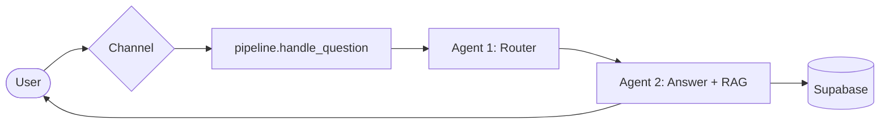
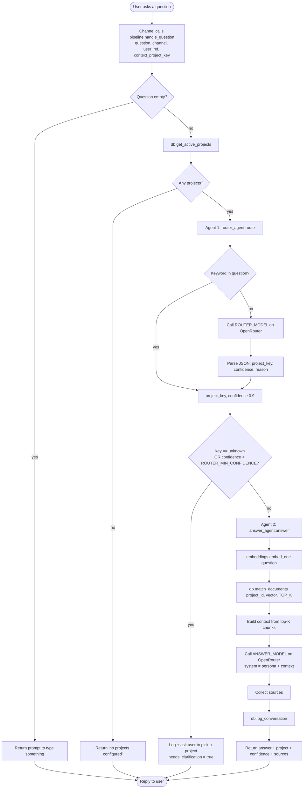
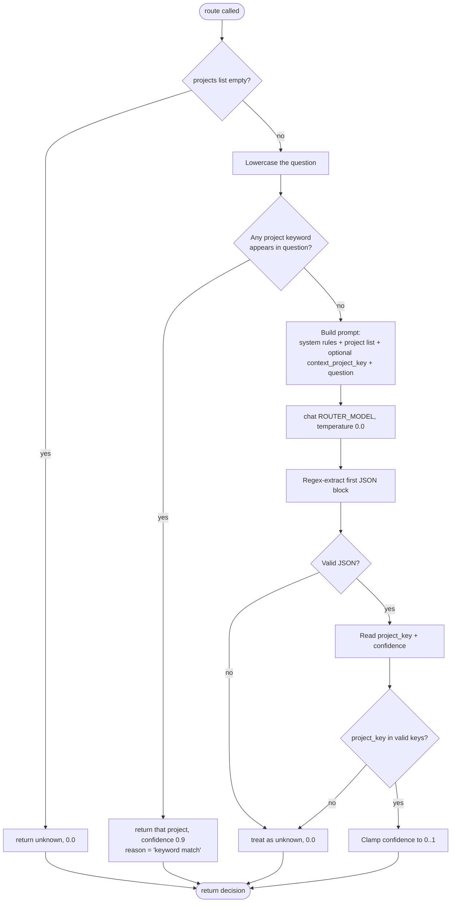
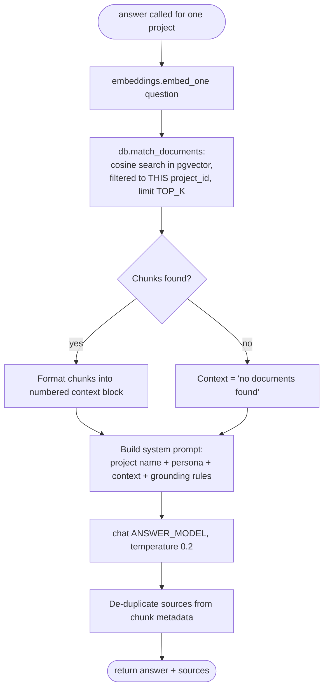
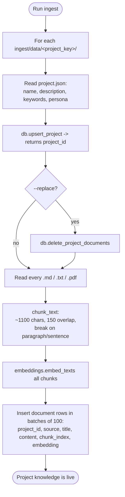
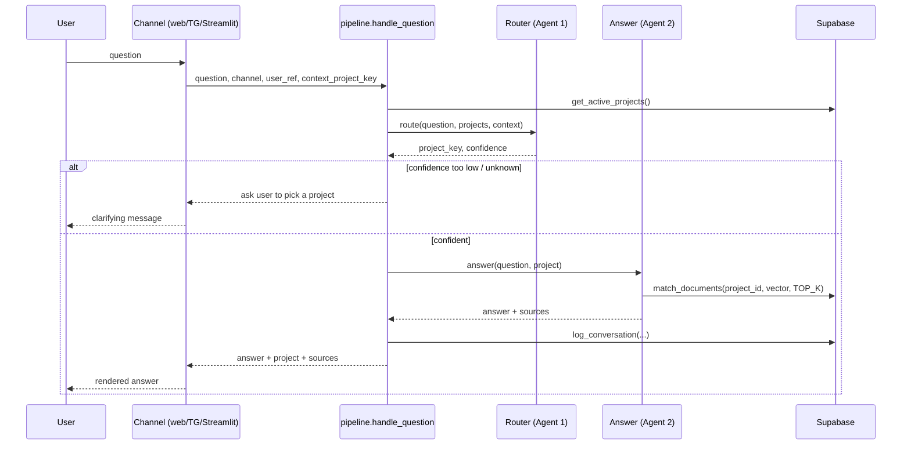
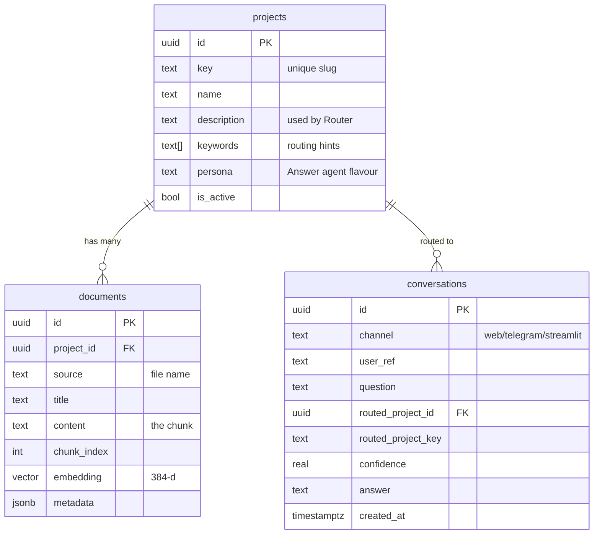

# kkAgentic Support — Framework Flow & Logic Map

> A single reference for **how the whole system thinks**, so you can trace any request end‑to‑end
> and know exactly where to plug in when you expand. Read top‑to‑bottom the first time; after that,
> jump to the section you need via the table of contents.

## Table of contents
1. [Mental model in one minute](#1-mental-model-in-one-minute)
2. [Component map (what each file owns)](#2-component-map-what-each-file-owns)
3. [End-to-end request flow](#3-end-to-end-request-flow)
4. [Sub-flow A — The Router (Agent 1)](#4-sub-flow-a--the-router-agent-1)
5. [Sub-flow B — The Project Answer agent (Agent 2 / RAG)](#5-sub-flow-b--the-project-answer-agent-agent-2--rag)
6. [Sub-flow C — Ingestion (how knowledge gets in)](#6-sub-flow-c--ingestion-how-knowledge-gets-in)
7. [Channel flows (web / Telegram / Streamlit)](#7-channel-flows-web--telegram--streamlit)
8. [Data model](#8-data-model)
9. [Configuration map (env → behavior)](#9-configuration-map-env--behavior)
10. [Decision & state reference](#10-decision--state-reference)
11. [Failure & edge-case handling](#11-failure--edge-case-handling)
12. [Expansion playbooks](#12-expansion-playbooks)
13. [Roadmap / where to grow next](#13-roadmap--where-to-grow-next)

---

## 1. Mental model in one minute

There are **two AI agents** and **one knowledge store**:

- **Agent 1 — Router.** Looks at a question and answers a single question of its own:
  *"which project is this about, and how sure am I?"* It does **not** answer the user.
- **Agent 2 — Project Answer agent.** Once the project is known, this agent pulls that
  project's relevant docs/FAQ out of the knowledge store and writes the actual answer,
  **grounded only in what it retrieved**.
- **Knowledge store — Supabase + pgvector.** Each project's documents and FAQ live here as
  searchable embeddings, kept isolated per project. Every conversation is logged here too.

Everything else (web page, Telegram, Streamlit, API) is just a **doorway** into one shared
function: `core/pipeline.py → handle_question()`. That single entry point is the spine of the
framework — if you understand it, you understand the system.

---

## 2. Component map (what each file owns)

| Layer | File | Single responsibility |
|---|---|---|
| **Spine** | `core/pipeline.py` | Orchestrates route → gate → answer → log. The only thing channels call. |
| **Agent 1** | `core/router_agent.py` | Classify question → `{project_key, confidence, reason}`. Keyword fast-path + model. |
| **Agent 2** | `core/answer_agent.py` | Retrieve chunks for one project, build context, generate grounded answer. |
| **LLM access** | `core/openrouter.py` | One `chat()` call to OpenRouter (OpenAI-compatible). Both agents use it. |
| **Vectors** | `core/embeddings.py` | Turn text → embedding. Local (free) or OpenAI backend. |
| **Storage** | `core/db.py` | All Supabase reads/writes: projects, vector search RPC, conversation log. |
| **Settings** | `core/config.py` | Reads `.env` into one `settings` object the whole app imports. |
| **Doorway** | `api/main.py` | FastAPI `/chat` + `/projects` (used by the web page). |
| **Doorway** | `telegram_bot/bot.py` | Telegram front-end; remembers last project per chat. |
| **Doorway** | `streamlit_app/app.py` | Streamlit console; session-based chat. |
| **Doorway** | `web/index.html` | Apple-style page; calls FastAPI `/chat`. |
| **Loader** | `ingest/ingest_docs.py` | Chunk → embed → upsert project + write document rows. |
| **Schema** | `supabase/schema.sql` | Tables, pgvector index, `match_documents` search function. |

**Golden rule for expansion:** new channels call `handle_question()`. New *intelligence*
(better routing, new retrieval, reranking, etc.) goes inside the agents. Never let a channel
talk to OpenRouter or Supabase directly — keep the spine in the middle.

---

## 3. End-to-end request flow

This is the full path of a single question, with every decision point numbered.

**The four gates that protect quality:**
1. **Empty-question gate** (step C) — never call a model on nothing.
2. **No-projects gate** (step E) — fail gracefully before routing.
3. **Confidence gate** (step K) — the most important one. If the router is unsure, the system
   asks the user to choose instead of sending the question to the wrong agent.
4. **Grounding gate** (inside step Q) — the answer agent is instructed to say *"I don't have
   that yet"* and offer escalation rather than invent an answer not in the context.

---

## 4. Sub-flow A — The Router (Agent 1)

**File:** `core/router_agent.py` · **Function:** `route(question, projects, context_project_key)`
**Returns:** `{ "project_key": str, "confidence": float (0..1), "reason": str }`

**Design choices worth remembering when you extend it:**
- **Keyword fast-path first** — cheap, deterministic, and saves a model call for obvious cases.
  Add keywords in each project's `project.json`.
- **`temperature = 0.0`** — routing must be stable, not creative.
- **Context stickiness** — `context_project_key` is passed in so follow-up questions
  ("and how do I undo that?") stay on the same project. The prompt tells the model to prefer it.
- **Strict validation** — any key the model returns that isn't a real project becomes `unknown`,
  which trips the confidence gate. The router can never invent a destination.
- **Output contract is JSON** — keep it. If you switch models, only the parsing in
  `_extract_json` needs to stay tolerant.

---

## 5. Sub-flow B — The Project Answer agent (Agent 2 / RAG)

**File:** `core/answer_agent.py` · **Function:** `answer(question, project, top_k)`
**Returns:** `{ "answer": str, "sources": [str], "used_chunks": int }`

**Why it is built this way:**
- **Retrieval is scoped to one project** (`where project_id = ...` in `match_documents`). Projects
  never bleed into each other — that isolation is what makes "an agent per project" real.
- **The model only sees retrieved context**, not the whole knowledge base. This keeps prompts
  small, cheap, and grounded.
- **`persona`** from `project.json` is injected into the system prompt, so each project agent has
  its own tone/rules (e.g. "be careful with money questions").
- **Sources** are returned so every answer is auditable.
- **Grounding instruction** lives in `SYSTEM_TEMPLATE` — this is your main lever to tune
  honesty vs. helpfulness.

---

## 6. Sub-flow C — Ingestion (how knowledge gets in)

**File:** `ingest/ingest_docs.py` · **Run:** `python -m ingest.ingest_docs --all --replace`

**Mental note:** ingestion and answering **share the same embedding model** (`core/embeddings.py`).
If you ever change the embedding model, you must (a) update `EMBEDDING_DIM` + the `vector(N)` in
`schema.sql`, and (b) **re-ingest everything** so old and new vectors aren't mixed.

---

## 7. Channel flows (web / Telegram / Streamlit)

All three are thin. They differ only in **how they carry "context" (the last project)** and how
they render the reply.

| Channel | Where "last project" lives | Notes |
|---|---|---|
| **Web** (`web/index.html`) | JS variable `contextProject`, per browser tab | Sends it back as `project_key`; shows project + % match in the bubble. |
| **Telegram** (`telegram_bot/bot.py`) | `context.chat_data["project_key"]` per chat | `/reset` clears it; `/projects` lists agents. |
| **Streamlit** (`streamlit_app/app.py`) | `st.session_state.project_key` | "Reset conversation" button clears it. |

To **add a channel** (Discord, Slack, WhatsApp, email): build the doorway, store a "last project"
somewhere per-user, and call `handle_question(...)`. Nothing else changes.

---

## 8. Data model

- **`projects`** is read by the Router (description + keywords) and the Answer agent (name + persona).
- **`documents`** is the per-project vector store; queried by `match_documents`.
- **`conversations`** is your analytics + audit trail. Mine it for: most-asked topics, questions
  that hit the confidence gate (FAQ gaps), and low-source answers.

---

## 9. Configuration map (env → behavior)

| Env var | Controls | Change it when… |
|---|---|---|
| `OPENROUTER_API_KEY` | Access to both agents' models | First setup. |
| `ROUTER_MODEL` | Agent 1's brain | You want cheaper/faster or smarter routing. |
| `ANSWER_MODEL` | Agent 2's brain | You want better answer quality. |
| `ROUTER_MIN_CONFIDENCE` | The confidence gate threshold (default 0.45) | Too many wrong routes → raise it; too many "please pick" → lower it. |
| `TOP_K` | How many chunks the Answer agent retrieves (default 5) | Answers miss info → raise; answers ramble/cost too much → lower. |
| `EMBEDDING_BACKEND` / `EMBEDDING_MODEL_*` / `EMBEDDING_DIM` | Vectorization | Switching embedding models (then re-ingest + update schema). |
| `SUPABASE_URL` / `SUPABASE_KEY` | Storage | Setup. Service-role key for ingest; anon for read. |
| `TELEGRAM_BOT_TOKEN` | Telegram doorway | Enabling the bot. |
| `CORS_ALLOW_ORIGINS` | Which web origins may call `/chat` | Locking the API to your real web page domain. |

These are the **knobs you tune without touching code.** Most "the bot feels off" problems are a
`ROUTER_MIN_CONFIDENCE`, `TOP_K`, or model-choice adjustment.

---

## 10. Decision & state reference

**Decision points (in order):**
1. Empty question? → ask for input.
2. Any active projects? → if none, say so.
3. Keyword match? → route instantly at 0.9.
4. Router model verdict → `{key, confidence}`.
5. `key == unknown` or `confidence < ROUTER_MIN_CONFIDENCE`? → **clarify** (don't answer).
6. Chunks found for project? → context vs. "no documents" note.
7. Answer in context? → grounded answer vs. "I don't have that yet."

**State that persists vs. is ephemeral:**
- **Per-user "last project"** — ephemeral, lives in the channel (tab/chat/session). Not in the DB.
- **Knowledge (documents/embeddings)** — durable, in Supabase. Changes only via ingestion.
- **Conversation log** — durable, append-only, in Supabase.
- **Settings** — loaded once at process start from `.env` into `core/config.settings`.

---

## 11. Failure & edge-case handling

| Situation | What happens now | Where to change it |
|---|---|---|
| Router model returns bad/no JSON | Treated as `unknown` → confidence gate → user is asked to pick | `router_agent._extract_json` |
| Router picks a non-existent project | Forced to `unknown` | `router_agent.route` validation |
| No chunks found for a project | Context becomes "no documents found"; agent says it lacks info | `answer_agent._build_context` + system prompt |
| Supabase logging fails | Silently ignored so the user still gets an answer | `db.log_conversation` (wrapped in try/except) |
| Backend unreachable from web page | Friendly "couldn't reach backend" message in the chat | `web/index.html` fetch catch |
| OpenRouter/network error | Surfaces as an error string to the user via the channel's try/except | each channel + `openrouter.chat` |

**Principle:** the user always gets *a* reply; infrastructure problems degrade gracefully rather
than crash the conversation.

---

## 12. Expansion playbooks

### Add a new project
1. Create `ingest/data/<project_key>/project.json` (name, description, keywords, persona).
2. Drop `.md` / `.txt` / `.pdf` docs + FAQ in that folder.
3. `python -m ingest.ingest_docs --project <project_key> --replace`.
4. Done — the Router sees it automatically (it reads active projects live). No code change.

### Add a new channel (Slack, Discord, WhatsApp, email…)
1. Build the doorway that receives a message.
2. Keep a per-user "last project" value (cache/session/db).
3. Call `pipeline.handle_question(question, channel="slack", user_ref=user_id, context_project_key=last)`.
4. Render `result["answer"]` (+ project name + sources). No agent changes needed.

### Swap or upgrade a model
- Change `ROUTER_MODEL` and/or `ANSWER_MODEL` in `.env`. Restart. That's it.
- If the new router model formats JSON differently, only `_extract_json` may need a tweak.

### Improve retrieval quality
- Raise `TOP_K`, or add a **reranking** step inside `answer_agent.answer` (retrieve 20, rerank to 5).
- Add metadata filters (e.g. doc version, locale) to `match_documents` and the RPC.

### Add human handoff
- Add a `needs_human` boolean to the pipeline result (e.g. when `used_chunks == 0` or the answer
  contains the escalation phrase).
- In each channel, if `needs_human`, post to your support inbox / Slack / create a ticket.
- Add a `status` column to `conversations` to track escalations.

### Add feedback (👍/👎)
- Add buttons in web/Telegram/Streamlit that write a rating back to a `feedback` table keyed by
  the conversation id. Use low ratings to find FAQ gaps.

### Per-project analytics dashboard
- Read `conversations` grouped by `routed_project_key`, `confidence`, and date. Build it as a
  Streamlit page or a live artifact.

---

## 13. Roadmap / where to grow next

A suggested order, lowest effort → highest value:

1. **Confidence-gate tuning** with real traffic (watch the `conversations` table).
2. **Feedback buttons** → start collecting quality signal immediately.
3. **Human handoff** for unanswered / low-confidence questions.
4. **Reranking + larger `TOP_K`** for sharper answers as docs grow.
5. **Multi-turn memory** beyond "last project" (short rolling history per user).
6. **Auto-FAQ**: cluster logged questions that hit the gate, draft new FAQ entries, re-ingest.
7. **Per-project dashboards** and **scheduled digests** of what users are asking.

> Keep the spine sacred: every new feature either tunes a **knob** (`.env`), enriches an **agent**
> (`router_agent` / `answer_agent`), adds a **doorway** (channel), or extends the **store**
> (Supabase). If a change doesn't fit one of those four buckets, it probably belongs in the
> pipeline — and that's the one place to think carefully before editing.
